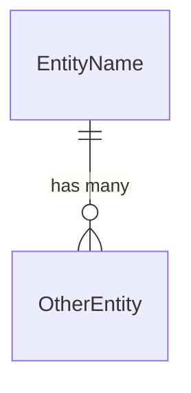

# Overview

Brief description of this data model and its purpose.

# Entities

## EntityName

| Field           | Type     | Required | Description              | Constraints          |
| --------------- | -------- | -------- | ------------------------ | -------------------- |
| id              | UUID     | yes      | Primary identifier       | Unique               |
| created_at      | datetime | yes      | Creation timestamp       | Immutable            |
| field_name      | string   | yes      | Description              | Max 255 chars        |

**Indexes:**
- `idx_entity_field` on `field_name` — supports lookup by field

**Relations:**
- belongs to `OtherEntity` via `other_entity_id`

## OtherEntity

| Field           | Type     | Required | Description              | Constraints          |
| --------------- | -------- | -------- | ------------------------ | -------------------- |
| …               | …        | …        | …                        | …                    |

# Relationships Diagram

# Migration Notes

Key considerations for implementing this data model:
- …
